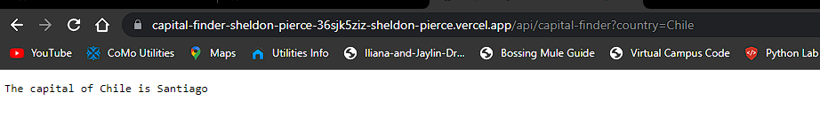
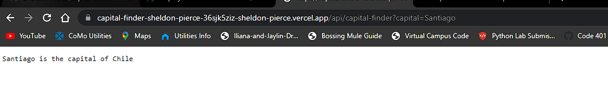

LAB - Class 16

Project: Capital-Finder

Author: Sheldon Pierce

Links and Resources
- back-end server url 

  - https://capital-finder-sheldon-pierce-8amqqk4g2-sheldon-pierce.vercel.app/
- front-end application N/A

Setup

.env requirements N/A

i.e.

- PORT - Port Number - N/A

How to initialize/run your application (where applicable)
### Searching for the City
[Country-Search](https://capital-finder-sheldon-pierce-36sjk5ziz-sheldon-pierce.vercel.app/api/capital-finder?country=Chile)

### Searching for the Capital
[Capital-Search](https://capital-finder-sheldon-pierce-36sjk5ziz-sheldon-pierce.vercel.app/api/capital-finder?capital=Santiago)

How to use your library N/A

Tests
- How do you run tests? N/A
- Any tests of note? N/A
- Describe any tests that you did not complete, skipped, etc N/A